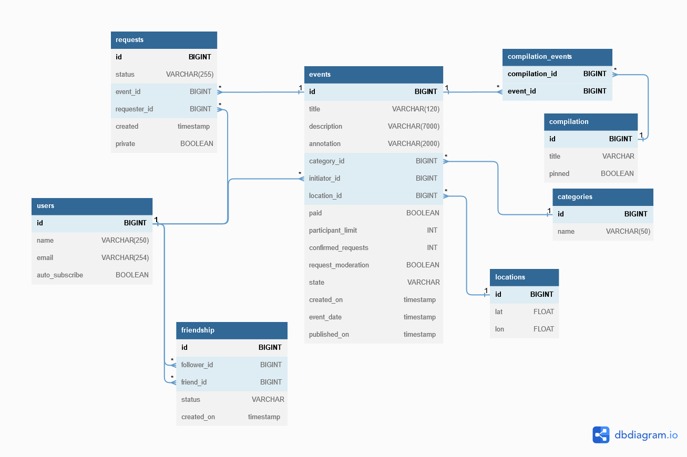

# Explore With Me
Сервис-афиша для размещения информации о событиях(от выставки до похода в кино), на котором пользователи могут находить компанию для участия в них.
## Стек
* Java 11
* Spring Boot
* Hibernate
* QueryDSL
* PostgreSQL
* Maven
* Docker

## Архитектура
Сервис состоит из двух модулей:
1. [Основной сервис](ewm-service/ReadMe.md) — отвечает за обработку информации, которая связана с событиями.
   - Основной функционал
       * Public API - доступен без регистрации
          * просмотр событий и подборок событий
          * просмотр категорий
        * Private API - доступен только зарегистрированным пользователям
          * Добавление и редактирование события
          * Работа с запросами на участии в событие
          * Подача/отмена запроса на участие в событии
          * Просмотр информации о запросах на участие
          * Получение полной информации о событиях текущего пользователя
        * Admin API - доступен администратору сервиса
          * Добавление/изменение/удаление категорий
          * Добавление/удаление пользователей
          * Создание/редактирование/удаление подборок событий
          * Получение информации о пользователе
          * Обновление информации о событии
    - Дополнительный функционал
        * [Подписка на друзей](FollowFriend.md)

3. [Сервис статистики](ewm-stats-server/ReadMe.md) — хранит количество просмотров и позволяет делать различные выборки.

## Схема БД

## Docker start-up guide
    mvn clean package
    docker-compose up -d

    Main service: http://localhost:8080
    Statistic service: http://localhost:9090
